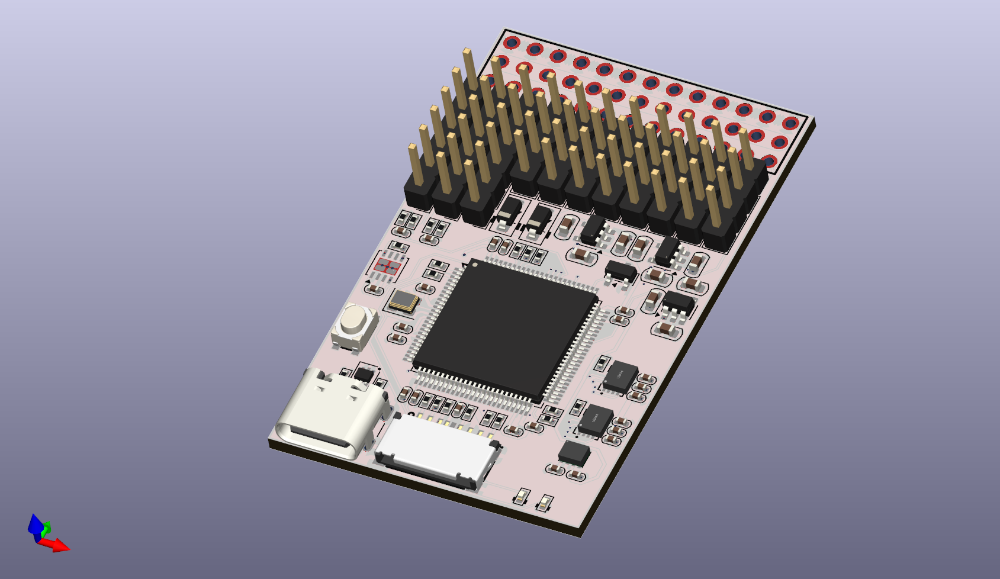
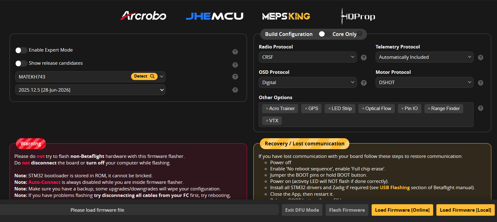
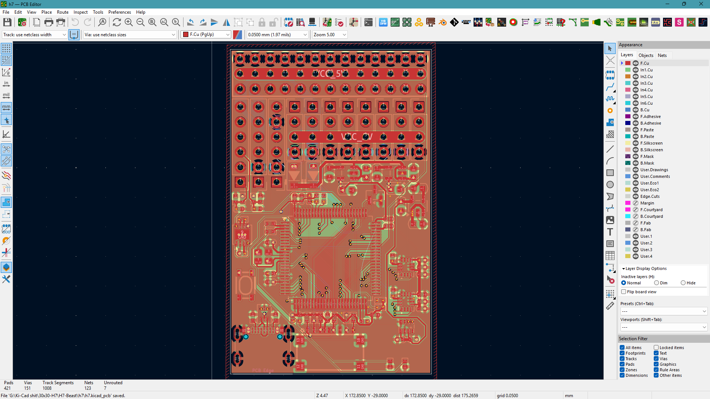
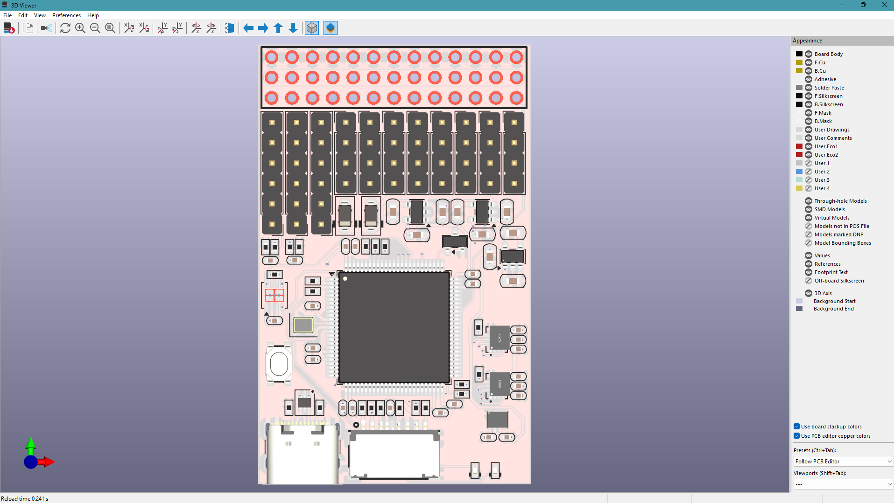
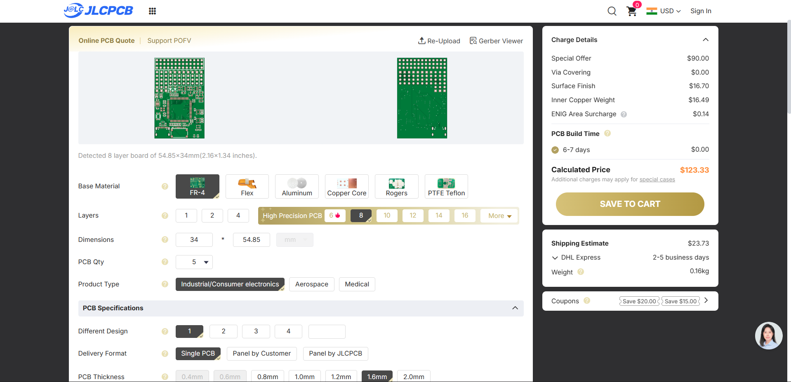
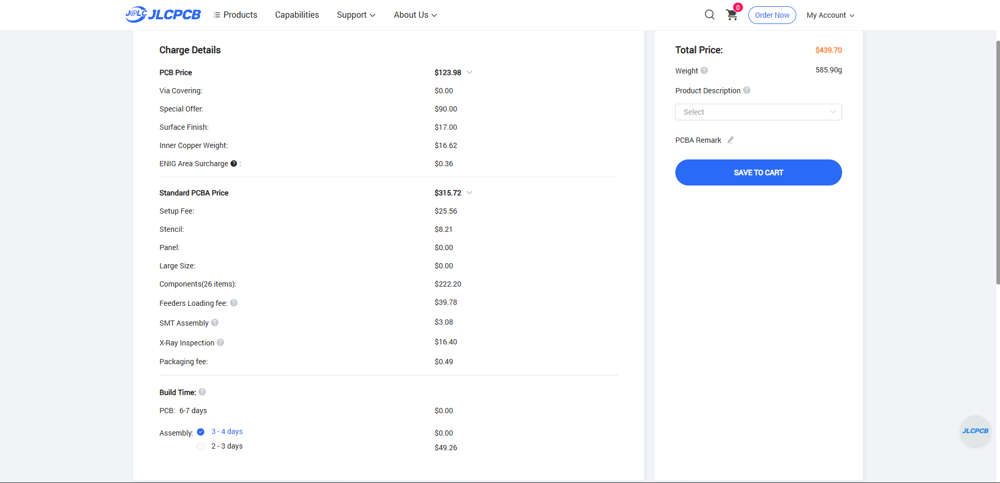

# H7 Beast

H7 Beast is a small open source flight controller that is based of Betaflight, INav, ArduPilot and PX4 firmware. The size of the board with the features is amazing it's just 58x34mm wide and comes with all the features like external spi and canbus and 12 motor output with a single output for ws2812b leds

## Features

- MCU: STM32H743VIT6
- Gyroscope: 2x ICM-42688-P with low noise 3.3v Rail
- Barometer: DPS310
- Blackbox: Sd Card interface
- UARTs: 7x UARTs
- i2C: 2x i2C, 1 internal and 1 external
- SPI: 4x SPI, 3x internal 1x external
- CAN: 1x External Can
- Digital VTX Out: 1x
- MIC5219 low-noise LDO regulators

## Betaflight, INav, ArduPilot and PX4 firmware

As i have used the hardware definition by MatekH743 we can already see the target available in the configurator

# PCB Design

This is my first ever 8 layer design for a compact wing based fliht controller, so it is a bit messy but functional

With a Non-BGA chip i have the design pretty easy and managable with 8 layers, and it can fit small uavs easily, it comes with 5v circuit protection from external esc's and 5v from usb input

This can be powered through external 5v bec from the esc's or any other 5v power source

# Steps to reproduce

U can upload the [gerber](production/h7.zip) to the JLCPCB and select 1oz ENIG and 1oz copper for inner layer
For the assembly we only need the front side to be assembled so we can choose that and then upload the [bom](production/bom.csv) and [designator](production/designators.csv) files to get a quote on the bom and u can order the project

But if u want to hand assmeble the whole thing u can also do that by using [Interactive BOM](h7/bom/ibom.html)

